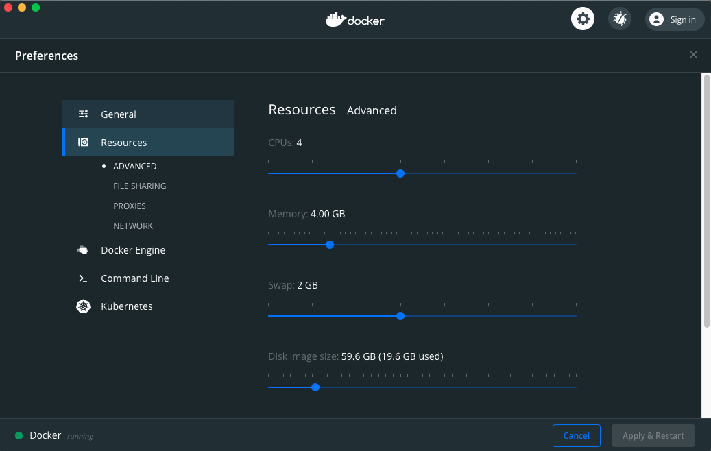

# SUPERSONIC DEVELOPMENT DEMO

Test project to create a skeleton app for node.js in typescript on a docker container running by a docker-compose with
visual studio code

# https://www.docker.com/blog/keep-nodejs-rockin-in-docker/

This is my preferred method when doing pure-Docker development. It works great with a few rules you must follow for
local development:

1. Develop only through the container. Why? Basically, you don’t want to mix up the node_modules on your host with the
   node_modules in the container. On macOS and Windows, Docker Desktop bind-mounts your code across the OS barrier, and
   this can cause problems with binaries you’ve installed with npm for the host OS, that can’t be run in the container
   OS.

2. Run all your npm commands through docker-compose. This means your initial npm install for your project should now be
   command: /bin/sh -c "npm ci && while sleep 1000; do :; done".

# npm ci vs. npm install

# https://medium.com/better-programming/npm-ci-vs-npm-install-which-should-you-use-in-your-node-js-projects-51e07cb71e26

---

<h3>Docker desktop resources recommended settings</h3>
</img>
